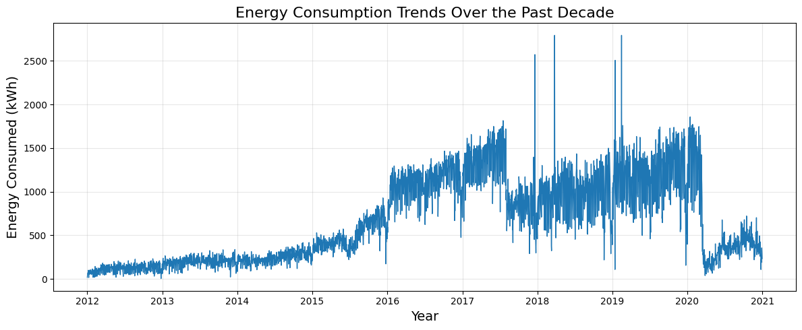
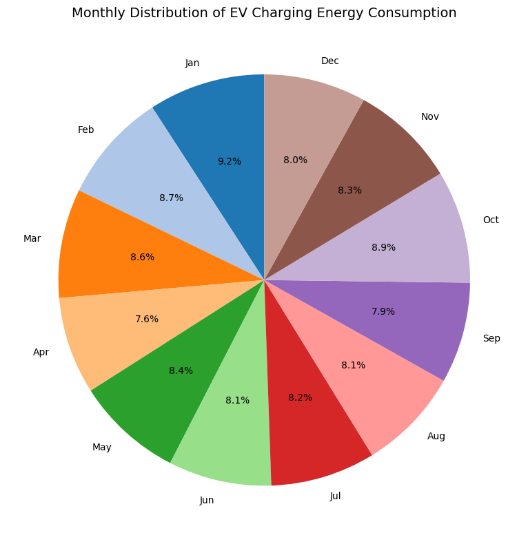
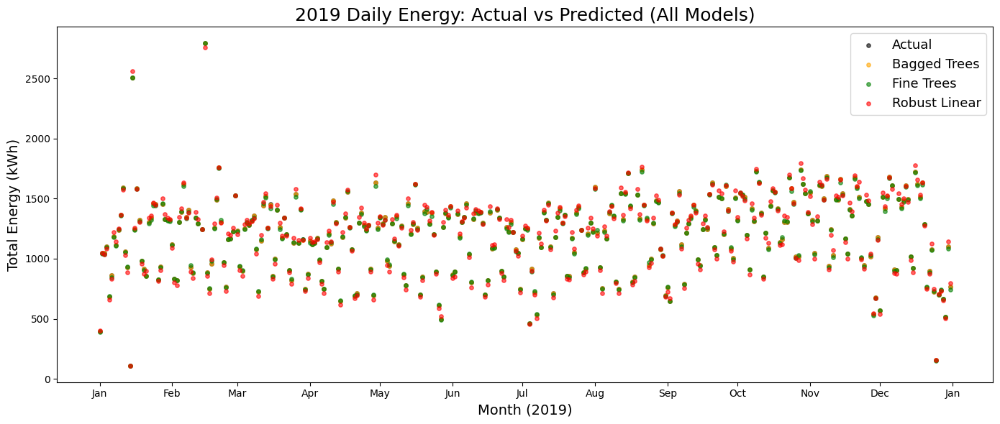
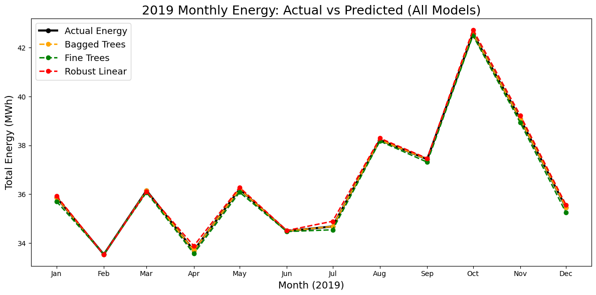
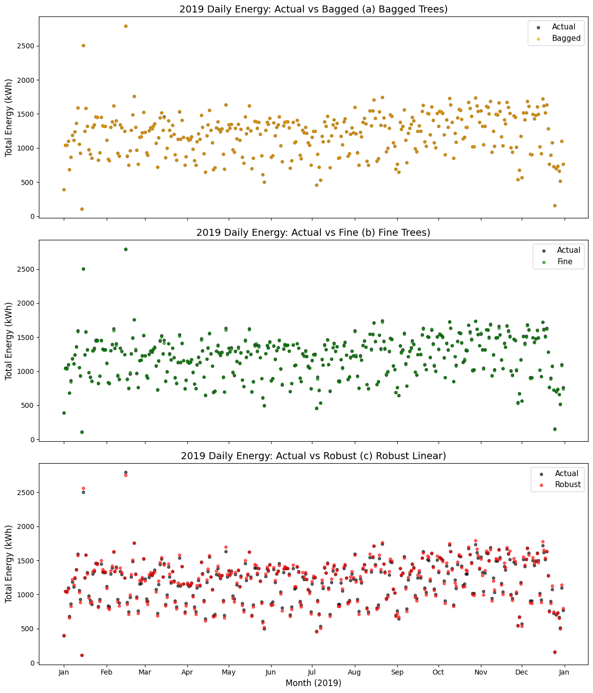
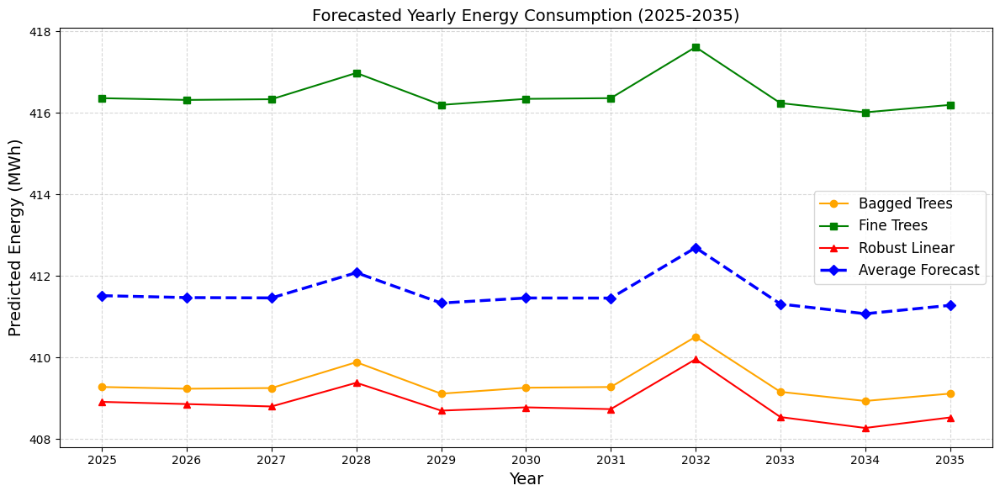
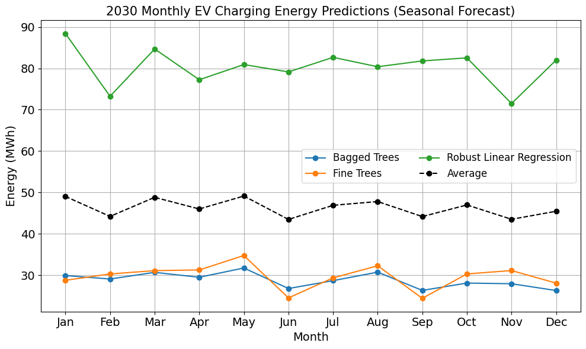

# Comparative Forecasting of Electric Vehicle Charging Demand Using Regression Models

<div align = "center">
[](./Paper.pdf)
[](./EV_Charging_Demand_Forecasting.ipynb)
[](https://www.kaggle.com/datasets/venkatsairo4899/ev-charging-station-usage-of-california-city)
</div>
<div align = "center">
<b>Parth Goyal¹, Ria Chadha², Anuradha Tomar¹</b> <br>
¹ Instrumentation and Control, ² Information Technology <br>
Netaji Subhas University of Technology, New Delhi, India
</div>

---

## Abstract

Electric vehicle (EV) adoption is accelerating, and with it the strain on charging
infrastructure and the electricity grid. Reliable forecasting of EV charging demand is
essential for grid stability, infrastructure planning, and sustainable EV ecosystem
development. This study presents a comparative evaluation of three regression-based
forecasting models — **Bagged Trees Ensemble**, **Fine Trees Regression**, and **Robust
Linear Regression** — trained on ten years (2012–2020) of real charging session data from
Palo Alto, California. Model performance is assessed using RMSE, MAE, R², and relative
error. The Bagged Trees Ensemble achieved the best performance (**RMSE = 0.035 kWh**),
followed by Fine Trees (RMSE = 0.894 kWh) and Robust Linear Regression (RMSE = 1.116 kWh).
Long-term forecasts extending to 2035, along with a seasonal forecast for 2030, both
indicate a sustained upward trend in charging demand with recurring winter peaks —
underscoring the need for proactive grid and infrastructure planning.

**Keywords:** electric vehicle charging, regression models, comparative study, load
forecasting, power station analysis

---

## Table of Contents

1. [Introduction](#introduction)
2. [Dataset](#dataset)
3. [Methodology](#methodology)
4. [Forecasting Models](#forecasting-models)
5. [Results](#results)
6. [Repository Structure](#repository-structure)
7. [Running the Notebook](#running-the-notebook)
8. [Conclusion](#conclusion)
9. [Future Work](#future-work)
10. [Citation](#citation)

---

## Introduction

As EV adoption grows, charging infrastructure must scale to meet demand without
destabilizing the grid. Forecasting EV charging demand allows utilities and policymakers
to plan capacity, manage peak loads, and design effective tariff and incentive structures.

This work applies the **Regression Learner** methodology to compare three forecasting
approaches — an ensemble method (Bagged Trees), a robust linear method (Robust Linear
Regression), and a tree-based method (Fine Trees Regression) — and identifies which model
provides the most reliable long-term prediction of EV charging demand for the city of
Palo Alto, California.

---

## Dataset

| | |
|---|---|
| **Source** | [EV Charging Station Usage of California City](https://www.kaggle.com/datasets/venkatsairo4899/ev-charging-station-usage-of-california-city) (Kaggle) |
| **Location** | Palo Alto, California, USA |
| **Time period** | 2012 – 2020 |
| **Granularity** | Individual charging sessions (start/end timestamps, energy, savings) |
| **Train / test split** | 2012–2018 (train) / 2019 (test) |

Each record includes session start and end times, energy delivered (kWh), gasoline
savings (gallons), and greenhouse gas (GHG) savings (kg). The dataset is downloaded
automatically via `kagglehub` — no manual download is required.

---

## Methodology

The end-to-end workflow follows the pipeline below:

```
Data Acquisition  →  Data Preprocessing  →  Feature Engineering
        →  Model Training  →  Model Evaluation  →  Forecasting & Analysis
```

1. **Data Acquisition** — Collect charging session records from charging stations.
2. **Data Preprocessing** — Remove duplicates and irrelevant columns, parse timestamps,
   and restrict the dataset to the 2012–2020 study window.
3. **Feature Engineering** — Derive charging duration (hours), charging time (hours),
   charging efficiency (kWh/h), and calendar features (year, month, day, hour, day of
   week).
4. **Model Training** — Train Bagged Trees, Fine Trees, and Robust Linear regressors on
   2012–2018 data.
5. **Model Evaluation** — Evaluate each model on 2019 data using RMSE, MAE, R², and
   relative error, supported by residual analysis.
6. **Forecasting & Analysis** — Generate short-term (2019), long-term (2025–2035), and
   seasonal (2030) demand projections.

### Exploratory Analysis

| Energy Consumption — Past Decade | Monthly Energy Distribution |
|---|---|
|  |  |

Charging demand remains fairly steady year-round with seasonal peaks in colder months —
attributable to reduced battery efficiency and additional energy required for battery
thermal management at low temperatures.

---

## Forecasting Models

### 1. Bagged Trees Ensemble

An ensemble of regression trees, each trained on a bootstrap sample (bagging) of the
training data. The feature space is partitioned into disjoint regions per tree, and the
final prediction is the average across all trees:

$$\hat{Y}(x) = \frac{1}{B}\sum_{b=1}^{B} \hat{Y}^{(b)}(x)$$

Bagging reduces variance and improves model stability, particularly for complex,
non-linear data such as EV charging behavior.

### 2. Robust Linear Regression

A linear model of the form `yᵢ = β₀ + βᵗxᵢ + εᵢ`, fit by minimizing a robust loss function
(Huber) rather than ordinary least squares. Coefficients are estimated using **Iteratively
Reweighted Least Squares (IRLS)**, which down-weights outliers at each iteration —
improving stability on data that violates normality or homoscedasticity assumptions.

### 3. Fine Trees Regression

A finely-grained decision tree that recursively partitions the feature space into regions
`R₁, R₂, …, Rₘ`, predicting the mean target value within each region. Splits are chosen to
maximize the reduction in sum of squared errors (SSE) at each node. Fine Trees capture
non-linear patterns well but are more prone to overfitting than ensemble methods.

---

## Results

### Evaluation on 2019 Test Data (Table II)

| Model | RMSE (kWh) | MAE (kWh) | Relative Error (%) |
|---|---:|---:|---:|
| **Bagged Trees Ensemble** | **0.035** | **0.001** | **0.37** |
| Fine Trees | 0.894 | 0.563 | 9.55 |
| Robust Linear | 1.116 | 0.466 | 11.92 |

The Bagged Trees Ensemble consistently outperformed the other models across all
evaluation metrics, owing to its ability to reduce variance and capture non-linear
patterns in the data.

### Actual vs. Predicted Demand — 2019

| Daily — All Models | Monthly — All Models |
|---|---|
|  |  |

| Comparative Analysis |
|---|
|  |

The Bagged Trees predictions track the actual daily and monthly energy consumption most
closely, while Fine Trees and Robust Linear show larger deviations, particularly during
high-demand periods.

### Long-Term Forecast (2025–2035)

| Yearly Forecast |
|---|
|  |

All three models project a continued increase in EV charging demand through 2035, with
the Bagged Trees and Fine Trees forecasts trending closely together and the Robust Linear
forecast remaining comparatively flatter.

### Seasonal Forecast for 2030

| Seasonal Forecast |
|---|
|  |

The 2030 seasonal forecast shows the same winter-peak pattern observed in the historical
data (Oct–Jan), reinforcing the need for seasonally-aware capacity planning.

---

## Repository Structure

```text
.
├── EV_Charging_Demand_Forecasting.ipynb   # End-to-end pipeline (Colab-ready)
├── Paper.pdf                              # Full research paper
├── README.md                              # This file
└── assets/
    ├── energy_past_decade.png
    ├── monthly_distribution.png
    ├── 2019_all_models.png
    ├── 2019_monthly.png
    ├── 2019_comparison_plot.png
    ├── yearly_forecast.png
    └── 2030_seasonal_forecast.png
```

---

## Running the Notebook

The notebook is self-contained and designed to run on Google Colab with no manual setup:

1. Open `EV_Charging_Demand_Forecasting.ipynb` in Google Colab.
2. Run all cells sequentially — the dataset is downloaded automatically via `kagglehub`.
3. All figures (Figs. 5–10) and the evaluation table (Table II) will be generated inline.

### Dependencies

- `kagglehub`
- `pandas`, `numpy`
- `scikit-learn`
- `matplotlib`

---

## Conclusion

This study presented a comparative evaluation of three regression-based forecasting
techniques for EV charging demand using real operational data from Palo Alto,
California. The **Bagged Trees Ensemble** was consistently the most accurate across all
evaluation metrics, owing to its ability to reduce variance and capture non-linear
patterns in charging behavior. **Fine Trees Regression** captured complex non-linear
demand variations but was prone to overfitting, while **Robust Linear Regression** was
less adaptive to dynamic charging patterns. Long-term forecasting from 2025–2035 indicates
a significant upward trend in charging demand, with recurring seasonal peaks during winter
months — highlighting the importance of accurate demand forecasting for grid planning,
infrastructure investment, and sustainable EV ecosystem development.

---

## Future Work

- Incorporate additional contextual features such as weather, traffic, and electricity
  pricing to improve forecast accuracy.
- Explore hybrid and deep learning approaches (e.g., LSTM, GRU, Transformer-based models)
  for improved scalability and reduced error.
- Extend the analysis to multi-station and regional charging networks.

---

## Citation

If you use this code or build upon this work, please cite:

```bibtex
@INPROCEEDINGS{11402736,
  author={Goyal, Parth and Chadha, Ria and Tomar, Anuradha},
  booktitle={2025 5th International Conference on Internet of Things: Smart Innovation and Usages (IoT-SIU)}, 
  title={Comparative Forecasting of Electric Vehicle Charging Demand Using Regression Models}, 
  year={2025},
  volume={},
  number={},
  pages={1-6},
  keywords={Measurement;Analytical models;Biological system modeling;Trees (botanical);Predictive models;Electric vehicle charging;Planning;Forecasting;Regression tree analysis;Load modeling;electric vehicle charging;regression model;comparative study;load forecasting;power station analysis},
  doi={10.1109/IOT-SIU65919.2025.11402736}}
```

---

## Authors

- **Parth Goyal** — Instrumentation and Control, NSUT - [Contact](mailto:parthgoya789@gmail.com)
- **Ria Chadha** — Information Technology, NSUT - [Contact](mailto:riachadha2005@gmail.com)
- **Anuradha Tomar** — Instrumentation and Control, NSUT 

